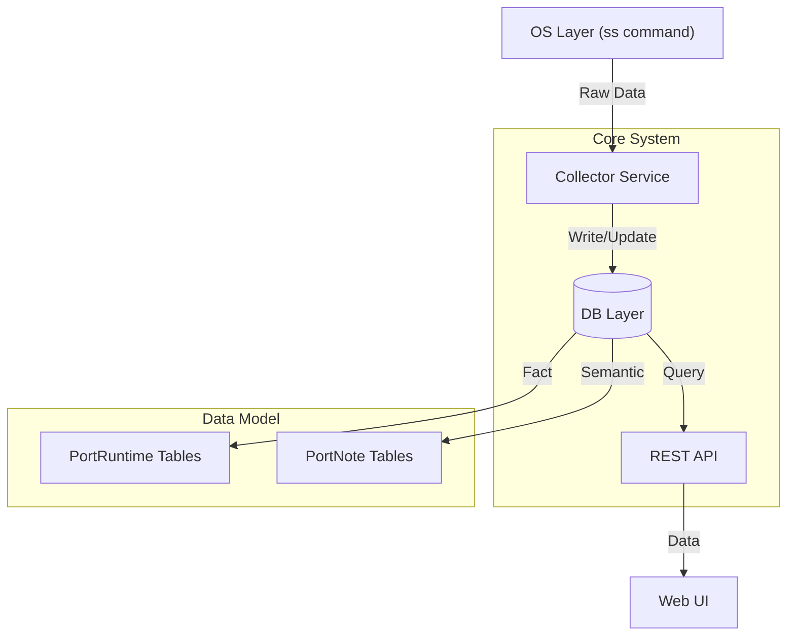

# Portmonote (Port Memory / Port Atlas)

[English](./README.md) | [中文](./README_CN.md)

## 1. System Goal

**Core Philosophy**: Enable administrators to judge the system status in one sentence: "I know at a glance what this machine is doing, which services I recognize, which ones I don't, and which ones are unhealthy."

Portmonote is not intended to replace Prometheus (monitoring metrics) or Nmap (security scanning), but to solve the problems of **"Service Presence"** + **"Memory"** + **"State Evolution"**.

### Key Principles
- **Separation of Fact and Memory**: The physical state of a port (Listen/Close) is an objective Fact, while remarks and risk levels are Memory. The two must be decoupled.
- **Sense of Time**: The system builds a timeline of services by recording "first seen," "last valid," and "time of disappearance," rather than just displaying a current snapshot.

## 2. Architecture

Adopts a **Minimal & Stable** architectural design.



- **Collector**: Runs periodically (APscheduler), executing system command `ss -lntupH` and parsing it.
- **DB Layer**: SQLite. Strictly separates **Runtime (Automatic)** from **Note (Manual)**.
- **Web UI**: Provides card views, displaying state evolution and risk perception.

## 3. Data Models

### 3.1. PortRuntime (Fact Table - Automatically Maintained)
| Field | Type | Description |
|-------|------|-------------|
| `id` | PK | |
| `host_id` | String | Machine identifier (supports multi-machine extension) |
| `protocol` | Enum | TCP / UDP |
| `port` | Int | Port number |
| `first_seen_at` | DateTime | First discovered time |
| `last_seen_at` | DateTime | Last alive time |
| `last_disappeared_at` | DateTime | Last disappeared time |
| `current_state` | Enum | `active` / `disappeared` |
| `current_pid` | Int | Current/Last PID |
| `process_name` | String | Process name (e.g., mysqld) |
| `cmdline` | String | Full command line |
| `uptime_seconds` | Int | Estimated uptime |

**Index**: UNIQUE on `(host_id, protocol, port)`

### 3.2. PortEvent (Timeline Table - Auto Recorded)
| Field | Type | Description |
|-------|------|-------------|
| `id` | PK | |
| `port_runtime_id` | FK | Associated Runtime |
| `event_type` | Enum | `appeared` (New), `alive` (Heartbeat), `disappeared` (Gone) |
| `timestamp` | DateTime | Event time |
| `pid` | Int | PID at that time |

### 3.3. PortNote (Semantic Table - Manually Maintained)
| Field | Type | Description |
|-------|------|-------------|
| `id` | PK | |
| `host_id` | String | |
| `protocol` | Enum | |
| `port` | Int | |
| `title` | String | Human-readable title (e.g., "FRP Control") |
| `description` | Text | Detailed description |
| `owner` | String | Owner |
| `service_type` | Enum | `web`, `db`, `tunnel`, `test`, `unknown` ... |
| `risk_level` | Enum | `trusted`, `expected`, `suspicious` |
| `tags` | JSON | Tags |

**Logical Association**: Softly associated with Runtime via `(host_id, protocol, port)`. This ensures that even if Runtime data is cleaned, Note remains.

## 4. Core Logic

### 4.1. Collector
Frequency: Every 1 hour

1. **Execute**: `ss -lntupH`
2. **Parse**: Structure PID, Process, Port, Protocol.
3. **Compare & Update**:
    - **Existing**: Update `last_seen_at`, `current_pid`.
    - **New**: Create `PortRuntime`, set `first_seen_at`, record `appeared` event.
    - **Missing** (Not present this round but active in DB): Mark `current_state = disappeared`, update `last_disappeared_at`, record `disappeared` event. **Never physically delete.**

### 4.2. Derived States
UI calculates state based on data, rather than DB storage fields:

- **🟢 Healthy**: Active + High Uptime + Trusted Note
- **🟡 Flapping**: Frequent Appeared/Disappeared within a short time
- **🔴 Suspicious**: Active + No Note + Process Unknown
- **⚫ Ghost**: Disappeared + Note marked as Expected

## 5. Diagnostics (witr integration)

You can inspect any active port directly from the UI. This feature leverages the `witr` command-line tool.

1.  **Install witr**:
    Follow instructions at [https://github.com/pranshuparmar/witr](https://github.com/pranshuparmar/witr).
    ```bash
    # Example (Rust/Cargo)
    cargo install witr
    ```
2.  **Ensure Path**: Make sure `witr` is in the system PATH where Portmonote runs.
3.  **Use**: Click on any card -> "run witr".

## 6. Roadmap

1. **Backend Initialization**: FastAPI + SQLAlchemy + APScheduler. (Done)
2. **Collector Implementation**: `ss` parser implementation using Python. (Done)
3. **API Logic**: Endpoints to list ports with merged Fact+Note data. (Done)
4. **UI Implementation**: React/Vue based Dashboard using Cards. (Done)
