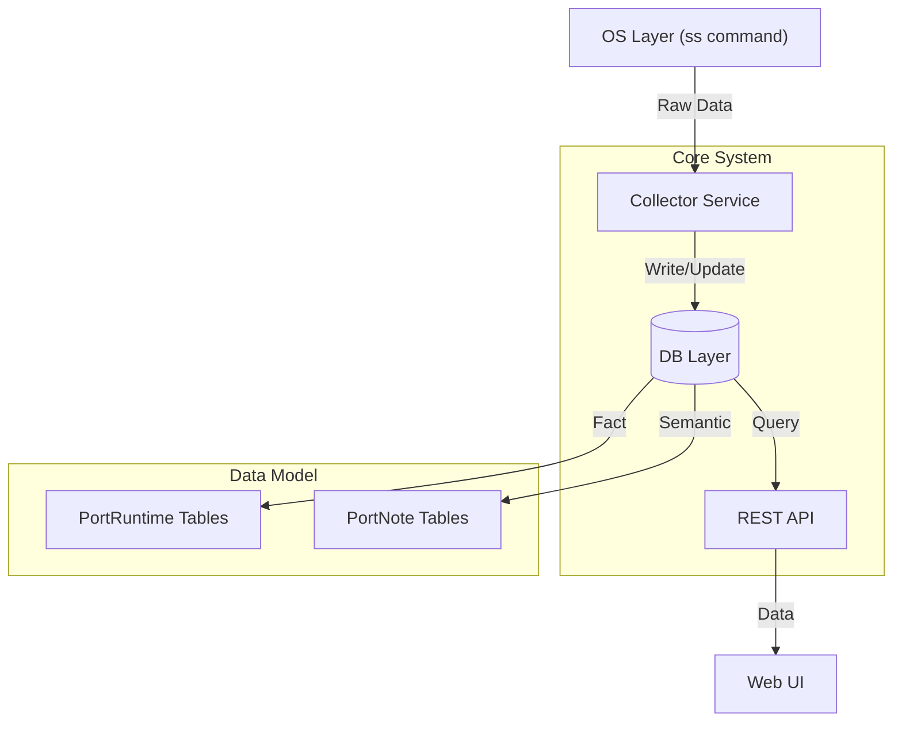

# Portmonote (Port Memory / Port Atlas)

## 1. 项目愿景 (System Goal)

**核心理念**：让管理员能通过一句话判断：“一眼就知道现在这台机器在干嘛，哪些是我认识的，哪些不认识，哪些不健康。”

Portmonote 不是为了取代 Prometheus (监控指标) 或 Nmap (安全扫描)，而是为了解决 **"服务存在感知 (Service Presence)"** + **"记忆 (Memory)"** + **"状态演化 (State Evolution)"** 的问题。

### 关键原则
- **事实与记忆分离**：端口的物理状态（Listen/Close）是客观事实 (Fact)，而备注、风险等级是人类记忆 (Memory)。两者必须解耦。
- **时间感**：系统通过记录“第一次出现”、“最近一次存活”、“消失时间”来构建服务的时间线，而非仅仅展示当前的快照。

## 2. 总体架构 (Architecture)

采用 **极简但非常稳 (Minimal & Stable)** 的架构设计。

- **Collector**: 周期性运行（类 Celery Beat/Cron/APScheduler），执行系统命令 `ss -lntupH` 并解析。
- **DB Layer**: SQLite/PostgreSQL。严格分离 **Runtime (自动)** 与 **Note (人工)**。
- **Web UI**: 提供卡片视图，展示状态演化和风险感知。

## 3. 数据模型 (Data Models)

### 3.1. PortRuntime (事实表 - 机器自动维护)
| Field | Type | Description |
|-------|------|-------------|
| `id` | PK | |
| `host_id` | String | 机器标识 (支持多机扩展) |
| `protocol` | Enum | TCP / UDP |
| `port` | Int | 端口号 |
| `first_seen_at` | DateTime | 首次发现时间 |
| `last_seen_at` | DateTime | 最近存活时间 |
| `last_disappeared_at` | DateTime | 最近消失时间 |
| `current_state` | Enum | `active` / `disappeared` |
| `current_pid` | Int | 当前/最后 PID |
| `process_name` | String | 进程名 (e.g., mysqld) |
| `cmdline` | String | 完整命令行 |
| `uptime_seconds` | Int | 在线时长估算 |

**索引**: UNIQUE on `(host_id, protocol, port)`

### 3.2. PortEvent (时间线表 - 自动记录)
| Field | Type | Description |
|-------|------|-------------|
| `id` | PK | |
| `port_runtime_id` | FK | 关联 Runtime |
| `event_type` | Enum | `appeared` (新发现), `alive` (心跳), `disappeared` (消失) |
| `timestamp` | DateTime | 事件发生时间 |
| `pid` | Int | 当时的 PID |

### 3.3. PortNote (语义表 - 人工维护)
| Field | Type | Description |
|-------|------|-------------|
| `id` | PK | |
| `host_id` | String | |
| `protocol` | Enum | |
| `port` | Int | |
| `title` | String | 人类可读标题 (e.g., "FRP Control") |
| `description` | Text | 详细描述 |
| `owner` | String | 负责人 |
| `service_type` | Enum | `web`, `db`, `tunnel`, `test`, `unknown` ... |
| `risk_level` | Enum | `trusted`, `expected`, `suspicious` |
| `tags` | JSON | 标签 |

**逻辑关联**: 通过 `(host_id, protocol, port)` 与 Runtime 软关联，这确保即使 Runtime 数据被清理，Note 依然保留。

## 4. 核心逻辑

### 4.1. 采集器 (Collector)
频率: 每 10-30 秒

1. **执行**: `ss -lntupH`
2. **解析**: 结构化 PID, Process, Port, Protocol。
3. **对比更新**:
    - **Existing**: 更新 `last_seen_at`, `current_pid`。
    - **New**: 创建 `PortRuntime`, 设置 `first_seen_at`, 记录 `appeared` 事件。
    - **Missing** (本轮未出现但库里是 active): 标记 `current_state = disappeared`, 更新 `last_disappeared_at`, 记录 `disappeared` 事件。**绝不物理删除**。

### 4.2. 状态衍生 (Derived States)
UI 根据数据计算状态，而非数据库存储字段：

- **🟢 Healthy**: Active + High Uptime + Trusted Note
- **🟡 Flapping**: 短时间内多次 Appeared/Disappeared
- **🔴 Suspicious**: Active + No Note + Process Unknown
- **⚫ Ghost**: Disappeared + Note marked as Expected

## 5. 项目结构 Roadmap

1. **Backend Initialization**: FastAPI + SQLAlchemy + APScheduler.
2. **Collector Implementation**: `ss` parser implementation using Python.
3. **API Logic**: Endpoints to list ports with merged Fact+Note data.
4. **UI Implementation**: React based Dashboard using Cards.
